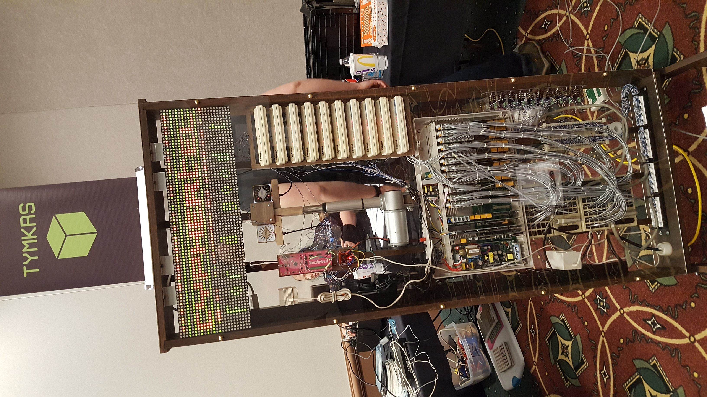

# CypherCon 3.0 Badge

The CypherCon 3.0 electronic badge is an interactive circuit board with a
modem. The tymkrs built a phone company in a box.

They put phone drops in all the villages where people could plug their badges
in and dial numbers that may resolve on the Private Branch Exchange (PBX).

The documentation for the phone can be found at
[HackTheBadge.com](http://hackthebadge.com/cyphercon-badge-3-0-documentation/)
and the tymkrs had printed out some hard copies of this documentation for the
conference attendees.

# Dialer

To get the badge in dial mode one must go through the menu system and a few
steps:  

1. Turn on the badge
2. Plug the badge into a phone cord connected to the PBX.
3. Hit the back bottom button until you see "APPSEL" on the LED display.
4. Touch "8" on the number pad.
5. Touch "#" to commit the selection.
6. Dial a number you want to call (hint 0 gets the operator).
7. Touch "#" to commit the number and start dialing.
