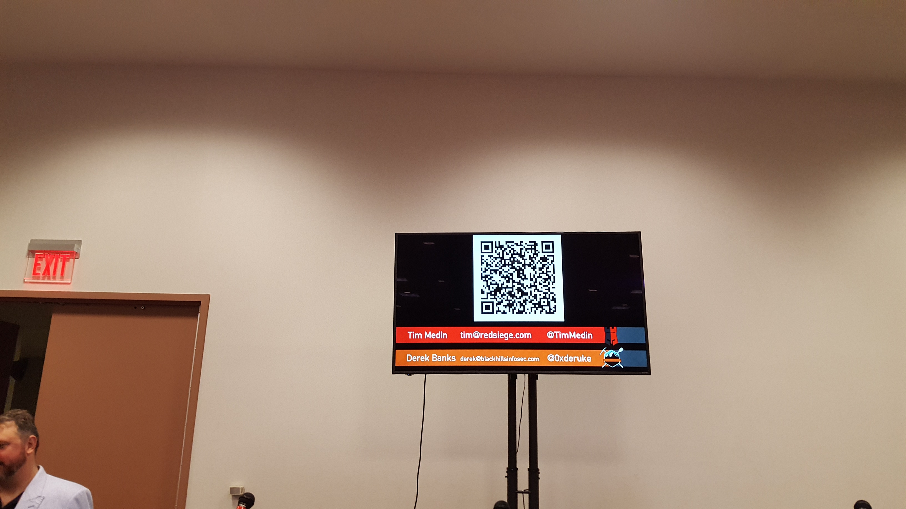

# Hack Dumerly Not Smarter

Presenter: Tim Medin
Date: 04/12/2018

Tim gave a presentation about computer security. He works in the computer
security company [RedSiege](http://www.redsiege.com) and is associated with
the SANS institute. He also taught the [CyberAces](#cyberaces) course that I
took in 2014.

Tim talked about how the Advanced Persistent Threat (APT) is not always so
"advanced" and we as computer professionals should focus on the basics first.

The Equifax security breach used a known vulnerability that was know about for
3 months before the attack. Not very persistent.

Instead of buying a new domain name with no reputation on some security tools
that track reputation. Tim said his company will purchase
[expired domains](https://www.expireddomains.net/) from companies that have
failed to keep the doors open but have built good reputations in the past.
These expired domains allowed work arounds to some security tools based on
reuptuation alone.

Tim said that companies were freaking out about the latest processor
vulnerability specter and meltdown. Customers asked their security company what
they should do he told them to improve their password rules. A simple pentest
revealed that people in this company were still using the classic password
rotation technique and found "fall2017" to be a valid password.

Hackers will use the easy ways to compromise security before bringing out the
big complex hacks that attack a processor speculative execution feature.

### Learn from noobs

Tim cited several pentest techniques that were dead simple to come up with.
Techniques more experience security professionals may have overlooked because
they were "too easy".

He said try to learn from new employees instead of shooting down their ideas.
Some times it takes a fresh set of eyes on the problem to come up with a
solution.

### CyberAces

I spoke with Tim after the talk. He said that they are bringing back the
[CyberAces](http://cyberaces.org) course soon. Watch this space!
